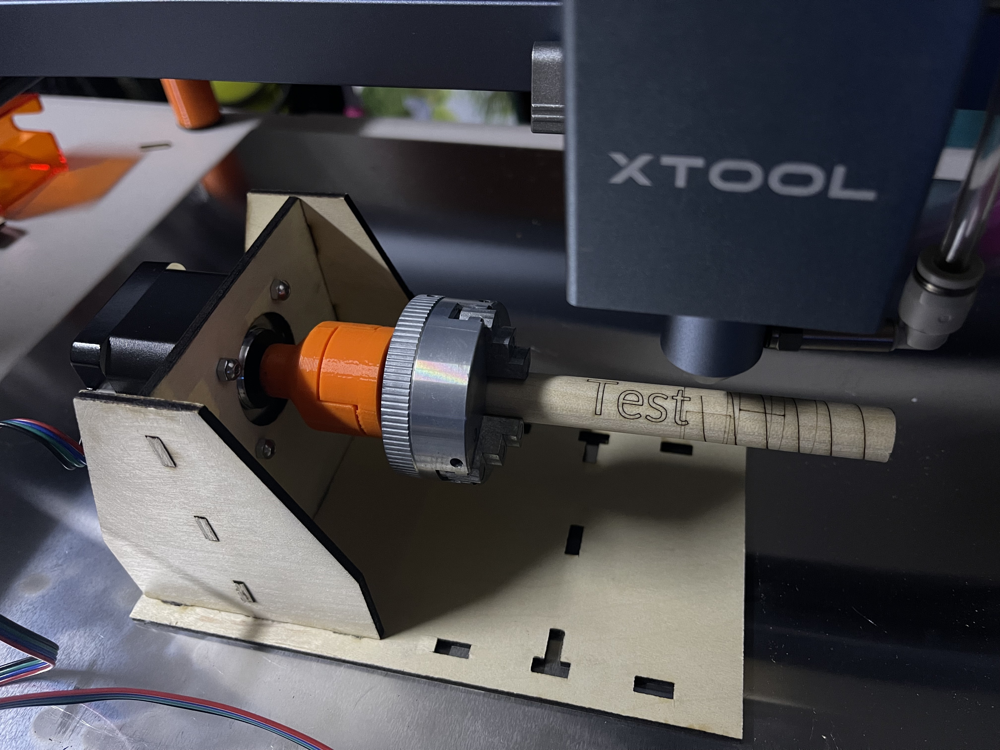
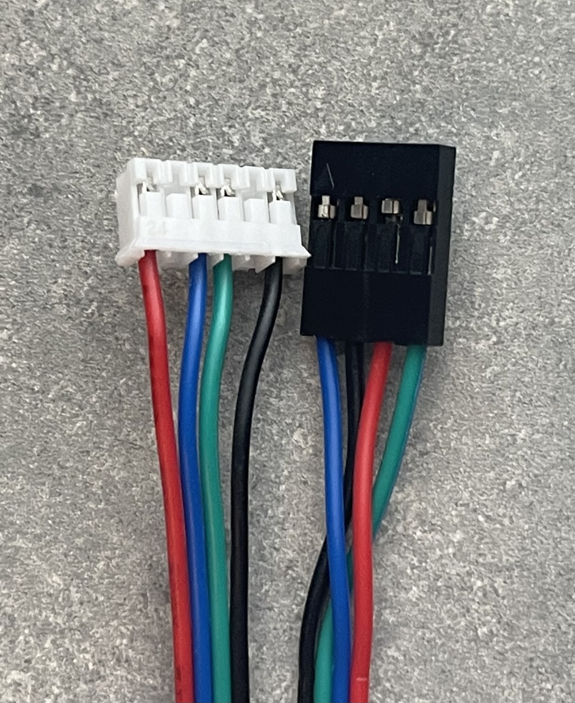

# rotary-attachment
## Simple inexpensive DIY rotary attachment for laser engravers

## Introduction

I wanted to start experimenting with a rotary attachment for my laser engraver (an xTool Pro D1 5W) but wasn't ready to shell out for a real rotary attachment. I figured that at its heart the rotary attachment is basically just a stepper motor with a bunch of various components added to it based on what you are trying to do, so I decided to start there. So bear in mind that a lot of what I say is coming from the perspective of my particular machine. I will also be using exclusively free software, so that means mainly FreeCAD and xTool Creative Space ("XCS") rather that more feature-filled or easier to use software.

Apologies this project is currently a mess, there is a lot left to do and the parts are currently very experimental, not really ready for prime time. I wanted to get them out there though so that others could start playing with them if they wanted.

# Stepper Motor
First you'll need a stepper motor, and a way to connect it to your machine. There are lots of options available. The size we are looking for is NEMA 17. There are generally 2 options for these: 1.8 degrees per step (for 200 steps per revolution) and 0.9 degrees per step (for 400 steps per revolution). Either one is fine depending on what you're trying to do.

Here are the two steppers that I have tried, purchased on Amazon. At the time of this writing the 1.8 deg/step stepper was about $10, and the 0.9 deg/step was about $16. Both come with a cable.

[STEPPERONLINE Nema 17 Stepper Motor Bipolar 1.5A 42Ncm 42x42x38mm 1.8deg 4 Wires with 1m Cable and Connector (1 Pack)](https://www.amazon.com/gp/product/B0B38GX54H), $9.99 at the time of this writing

[STEPPERONLINE 0.9deg Nema 17 Stepper Motor Bipolar 1.5A 30Ncm with 1 Meter Cable for 3D Printer CNC](https://www.amazon.com/gp/product/B0B8HB5N4S), $16.99 at the time of this writing

One important thing to note is that while these steppers come with cables that can plug in to the xTool D1 / D1 Pro, the connector is not polarized (so you can flip it backwards -- this is not dangerous, it just reverses the direction of travel) and most importantly, **the pins are not in the same order and need to be manually swapped to work**. You will do this by carefully using a tool to lift the little plastic fingers on the connector housing that hold the pins in place just enough, pulling the pins out, and then rearranging them. Below is a photo showing how I had to modify my wires -- the white connector remains the same, the black connector required that the pins be swapped around to match this orientation (blue / black / red / green).

## Compatibility with the xTool RA2 Pro Rotary Attachment
Coming from the xTool world, the main rotary attachment people use is either the xTool Rotary Attachment (rollers only), or the xTool RA2 Pro (rollers and a chuck). I don't have direct access to either of these, and the software (XCS) assumes you are using one of them, so we need to do some things to pretend we are using one of them.

# Chuck
I first started with modifying a 3D printed chuck, but found it lacking the ability to tighten to any useful degree. I then found a cheap chuck on Amazon and bought that. That one came with a spindle / "connecting rod" that threads into the chuck that I thought I might end up using, but so far I have not -- this can be purchased without that spindle for about $20 or so on Amazon, so unless you want to experiment, just get the bare chuck itself. Keep in mind that **this is a comically tiny chuck** and will have fairly limited utility, at least without some sort of modification down the road.

[This is the chuck I bought that includes the "connecting rod"](https://www.amazon.com/gp/product/B092M54CLJ). A keyword to search for is Z011, there are lots of options.

For my experiments I am mostly using what I call the "quadrant drive" as a way of connecting parts together to transfer torque between shafts and such. It's a simple thing I came up with that's kind of like a version of a Lovejoy coupling but uses 

[Quadrant Drive NEMA 17 shaft adapter](https://www.printables.com/model/415970-nema-17-to-quadrant-drive-shaft-adapter)

Now that our stepper has quadrant drive, we need our chuck to have quadrant drive.

[Quadrant Drive to 12x1 mm male thread](https://www.printables.com/model/415997-quadrant-drive-to-m12x1-male-thread)

