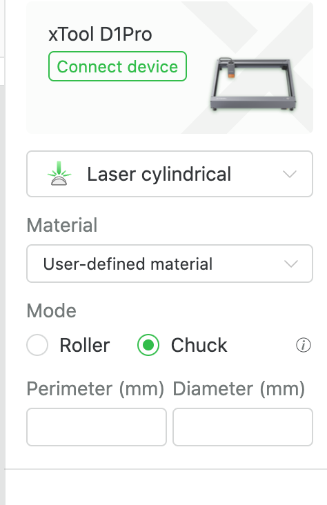

# rotary-attachment
## Simple inexpensive DIY rotary attachment for laser engravers

## Introduction

I wanted to start experimenting with a rotary attachment for my laser engraver (an xTool Pro D1 5W) but wasn't ready to shell out for a real rotary attachment. I figured that at its heart the rotary attachment is basically just a stepper motor with a bunch of various components added to it based on what you are trying to do, so I decided to start there. So bear in mind that a lot of what I say is coming from the perspective of my particular machine. I will also be using exclusively free software, so that means mainly FreeCAD and xTool Creative Space ("XCS") rather that more feature-filled or easier to use software.

Apologies this project is currently a mess, there is a lot left to do and the parts are currently very experimental, not really ready for prime time. I wanted to get them out there though so that others could start playing with them if they wanted.

    Stepper Motor

First you'll need a stepper motor, and a way to connect it to your machine. There are lots of options available. The size we are looking for is NEMA 17. There are generally 2 options for these: 1.8&deg; per step (for 200 steps per revolution) and 0.9&deg; per step (for 400 steps per revolution). Either one is fine depending on what you're trying to do.

Here are the two steppers that I have tried, purchased on Amazon. At the time of this writing the 1.8&deg;/step stepper was about $10, and the 0.9&deg;/step was about $16. Both come with a cable.

[STEPPERONLINE Nema 17 Stepper Motor Bipolar 1.5A 42Ncm 42x42x38mm 1.&deg; 4 Wires with 1m Cable and Connector (1 Pack)](https://www.amazon.com/gp/product/B0B38GX54H), $9.99 at the time of this writing

[STEPPERONLINE 0.&deg; Nema 17 Stepper Motor Bipolar 1.5A 30Ncm with 1 Meter Cable for 3D Printer CNC](https://www.amazon.com/gp/product/B0B8HB5N4S), $16.99 at the time of this writing

Wiring

One important thing to note is that while these steppers I am using come with cables that can plug in to the xTool D1 / D1 Pro, the connector is not polarized (so you can flip it backwards -- this is not dangerous, it just reverses the direction of travel) and most importantly, **the pins are not in the same order and need to be manually swapped to work**. You will do this by carefully using a tool to lift the little plastic fingers on the connector housing that hold the pins in place just enough, pulling the pins out, and then rearranging them. Below is a photo showing how I had to modify my wires -- the white connector remains the same, the black connector required that the pins be swapped around to match this orientation (blue / black / red / green).

If you use a stepper that is wired the same as the ones from xTool, none of this rewiring nonsense is needed. This is what I found for cheap, and through trial and error I got it working, so do with this information what you will.

Chuck

I first started with modifying a 3D printed chuck, but found it lacking the ability to tighten to any useful degree. I then found a cheap chuck on Amazon and bought that. That one came with a spindle / "connecting rod" that threads into the chuck that I thought I might end up using, but so far I have not -- this can be purchased without that spindle for about $20 or so on Amazon, so unless you want to experiment, just get the bare chuck itself. Keep in mind that **this is a comically tiny chuck** and will have fairly limited utility, at least without some sort of modification down the road.

[This is the chuck I bought that includes the "connecting rod"](https://www.amazon.com/gp/product/B092M54CLJ). A keyword to search for is Z011, there are lots of options.

For my experiments I am mostly using what I call the "quadrant drive" as a way of connecting parts together to transfer torque between shafts and such. It's a simple thing I came up with that's kind of like a version of a Lovejoy coupling but is designed to be simple to manufacture (machining or 3D printing), uses a full 50% of the "meat" to transfer torque, do not cam out or strip (the failure mode here is total destruction), is genderless, and is scale-invariant (so we can very easily mix and match different sizes of parts, rescale and re-print our objects without messing with compatibility), etc. It's not perfect or even ideal for this specific use but I like it because it's very versatile and makes it easy to try a lot of different things quickly.

[Quadrant Drive NEMA 17 shaft adapter](https://www.printables.com/model/415970-nema-17-to-quadrant-drive-shaft-adapter)

Now that our stepper has quadrant drive, we need our chuck to have quadrant drive.

[Quadrant Drive to 12x1 mm male thread](https://www.printables.com/model/415997-quadrant-drive-to-m12x1-male-thread)

### TODO:
- Add links to the 3D printed chuck I found, and the modified version I made for Quadrant Drive
- Come up with a better working 3D printed chuck that can tighten more!
- Come up with 3D printed jaws for the metal Z011 chuck that can adapt to something larger like a tumbler or glass

Configuration in xTools Creative Space ("XCS")

XCS assumes you are using one of the xTool brand rotary attachments, and thus is not really configurable to work with other software, so we will need to trick it a little bit to operate how we want. Below is a picture of the rotary configuration panel in XCS. Normally for the chuck you would enter the true diameter of the workpiece, but we can't do that because our rotary attachment is a bit different. The xTool rotary attachments all have (I believe...) 1.8&deg;/step steppers and a 4:1 pulley ratio, so that 4 rotations of the stepper motor shaft result in a single rotation of the chuck. In our current design we are not using any pulleys or gears so our ratio is 1:1. So under "Diameter" in XCS, we need to enter either 4 times the true diameter if we are using a 1.8&deg;/step motor, or 2 times the true diameter if we are using a 0.9&deg;/step motor.

